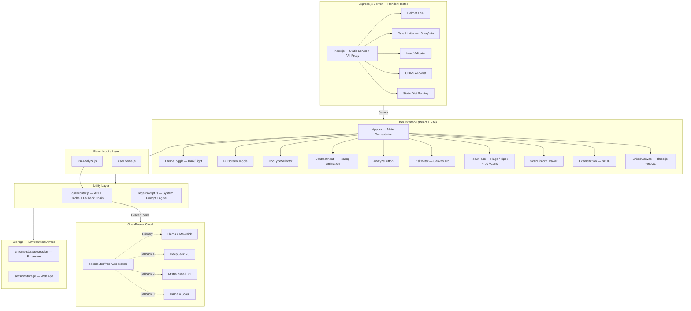

# 🛡️ LexGuard AI — Legal Guardian Angel

> **"Nobody reads contracts. We built the AI that reads them for you."**

LexGuard AI is a universal **Web Application + Chrome/Edge Extension** that analyses any legal document — rental deeds, PG agreements, employment contracts, Terms of Service, or Privacy Policies — and delivers a plain-English risk report with a stunning, responsive 3D animated interface.

Powered by **OpenRouter's free AI routing**, it automatically selects the best available model (Llama 4, DeepSeek V3, Mistral) with no paid API required.

---

## ✨ What Makes It Different

| Feature | LexGuard AI |
|---|---|
|  AI Engine | OpenRouter Auto-Router (free models, no paid key needed) |
|  Deployment | Works as Chrome Extension **and** a deployed Web App |
|  Input Modes | Drop PDFs, Paste Text, or **Live Photo OCR** via Tesseract.js (Hindi+English) |
|  Background | Live Three.js network animation — adapts to True Black Dark Mode / Light mode |
| Security | Helmet CSP, Tiered Rate Limits, Prompt Injection Shield, Session-only API keys |
|  Output | Risk score (0–100), Red Flags, Pros/Cons, Negotiation Tips, PDF Export |
|  History | Session-scoped scan history (extension: `chrome.storage`, web: `sessionStorage`) |
|  Responsive | Popup (400px) ↔ Fullscreen (800px) with native Fullscreen API on web |

---

## 🏗️ System Architecture



---

##  Folder Structure

```
lexguard-extension/
│
├── 📄 render.yaml              ← Render deployment blueprint
├── 📄 vite.config.js           ← Vite config + root redirect plugin
├── 📄 manifest.json            ← Chrome MV3 manifest
│
├── src/
│   ├── popup/
│   │   ├── App.jsx             ← Main UI orchestrator (fullscreen, theme, analyze)
│   │   ├── main.jsx            ← React entry point
│   │   ├── components/
│   │   │   ├── ShieldCanvas.jsx     ← Three.js WebGL particle network
│   │   │   ├── DocTypeSelector.jsx  ← Step 1: document type picker
│   │   │   ├── ContractInput.jsx    ← Step 2: floating paste textarea
│   │   │   ├── AnalyzeButton.jsx    ← Animated CTA with shimmer
│   │   │   ├── RiskMeter.jsx        ← Canvas arc gauge (0–100)
│   │   │   ├── ResultTabs.jsx       ← 4 result tabs
│   │   │   ├── ResultCard.jsx       ← Individual result card
│   │   │   ├── ScanHistory.jsx      ← Slide-up history drawer (async)
│   │   │   ├── ExportButton.jsx     ← jsPDF report download
│   │   │   ├── ThemeToggle.jsx      ← Sun/Moon animated toggle
│   │   │   ├── Onboarding.jsx       ← First-run API key setup
│   │   │   └── UpcomingFeatures.jsx ← Roadmap drawer
│   │   └── hooks/
│   │       ├── useTheme.js          ← Dark/light with chrome.storage + localStorage
│   │       └── useAnalyze.js        ← Analyze, history save/load (extension + web)
│   │
│   ├── utils/
│   │   └── openrouter.js            ← API client, fallback chain, parser, cache
│   │
│   ├── background/
│   │   └── service_worker.js        ← Chrome MV3 service worker
│   │
│   ├── options/
│   │   └── Options.jsx              ← Extension settings page
│   │
│   └── index.css                    ← Design system tokens + glassmorphism
│
├── server/
│   ├── index.js                ← Express server (security headers, CORS, rate limit)
│   ├── routes/
│   │   ├── analyze.js          ← POST /analyze endpoint
│   │   └── testConnection.js   ← GET /test-connection
│   └── prompts/
│       └── legalPrompt.js      ← Server-side AI system prompt
│
└── dist/                       ← Production build (Chrome extension loads this)
```

---

##  Method 1 — Run as Web App (localhost)

> Perfect for testing the full UI without loading the extension.

### Prerequisites
- Node.js 18+
- An OpenRouter API key — [get one free here](https://openrouter.ai/keys)

### Steps

```bash
# 1. Clone and install
git clone <your-repo-url>
cd lexguard-extension
npm install

# 2. Start the Vite dev server
npm run dev
```

Vite will start at `http://localhost:5173`. The custom redirect plugin will **automatically** send you to the correct page — no manual URL needed.

Open `http://localhost:5173` in your browser. You'll see the full LexGuard AI interface running as a web app.

> **Note:** On first launch, you'll be asked to enter your OpenRouter API key. It is stored in `sessionStorage` — never sent to any server. It clears automatically when you close the tab.

---

##  Method 2 — Run as Chrome / Edge Extension

### Step 1 — Build the Extension

```bash
npm install
npm run build
```

This creates the `dist/` folder — your installable extension package.

### Step 2 — Load into Chrome

1. Open `chrome://extensions/` in your browser
2. Enable **Developer mode** (toggle in the top-right corner)
3. Click **Load unpacked**
4. Select the `dist/` folder inside your project
5. Pin the 🛡️ **LexGuard AI** icon to your toolbar

### Step 3 — Use It

1. Click the LexGuard shield icon in your toolbar
2. Enter your OpenRouter API key on the setup screen (stored securely in `chrome.storage.session`)
3. Select a document type → paste your contract → click **Analyze**

> **Tip:** Click the ⊞ expand icon in the header to open LexGuard in a full browser tab for a wider, more comfortable view.

---

## 🚀 Method 3 — Deploy to Render (Live Web App)

The repo includes a `render.yaml` file for zero-config deployment.

### Steps

1. Push your repository to GitHub
2. Go to [render.com](https://render.com) → **New** → **Blueprint**
3. Connect your GitHub repository
4. Render detects `render.yaml` automatically and:
   - Installs frontend dependencies (`npm install`)
   - Builds the Vite production bundle (`npm run build`)
   - Installs backend dependencies (`cd server && npm install`)
   - Starts the Express server (`cd server && npm start`)
5. Your app is live at `https://your-app-name.onrender.com`

### Set Environment Variables on Render

| Variable | Value | Required |
|---|---|---|
| `NODE_ENV` | `production` | ✅ |
| `PORT` | `10000` | ✅ (set by Render automatically) |
| `ALLOWED_ORIGIN` | `https://your-app-name.onrender.com` | ✅ (for CORS) |

---

## 🔒 Security Overview

LexGuard is engineered to be resistant to common web attacks, employing a defense-in-depth approach:

| Attack Vector | Protection |
|---|---|
| **XSS** | Strict Content Security Policy (`helmet`), React's auto-escaping, no `innerHTML` |
| **Prompt Injection** | `sanitizeInput` middleware scans for jailbreaks (`DAN`, `ignore instructions`) and redacts them in-place |
| **SQL/Data Injection** | Null bytes, control chars, zero-width chars, and RTL overrides stripped before model inference |
| **DoS / Abuse** | Tiered rate limiting: 60 req/min global, 8 req/min per IP/UA on `/analyze`, 3 req/5s burst limiter |
| **CORS Abuse** | Hardened origin allowlist (regex for extensions + explicit domains only) |
| **Reconnaissance** | Response hardening strips `X-Powered-By` and `Server` headers. Suspicious payloads logged for audit |
| **Clickjacking** | `X-Frame-Options: DENY` header |
| **API Key Theft** | Keys stored exclusively in ephemeral `sessionStorage` (Web) / `chrome.storage.session` (Extension) — completely wiped when browser closes |
| **Error Leakage** | Server returns generic error messages in production, masking stack traces |
| **Oversized Payloads** | Body limit: `50kb`, `contractText` validated to max 40,000 chars server-side |

---

##  Upcoming Features

| Feature | Status | Description |
|---|---|---|
| 📸 Live Photo OCR | ✅ Done | Extract text from photographed paper contracts instantly via Tesseract.js |
| 🗂️ Bottom Navigation | ✅ Done | Modern 4-tab app layout (Analyze, Samples, History, Features) |
| 📦 Batch Auditing | 🔜 Planned | Upload and analyse multiple contracts at once with a comparison table |
| 🌍 Multi-language Support | 🔜 Planned | Analyse contracts in Hindi, Tamil, Bengali and other Indian languages |
| 🤝 Clause-by-Clause Negotiation | 🔜 Planned | AI suggests specific counter-clauses for each red flag |
| 📊 Risk Trend Dashboard | 🔜 Planned | Historical risk trends across all your scanned contracts |
| 🔔 Real-time Monitoring | 🔜 Planned | Watch mode for T&C / Privacy Policy pages — get alerted when they change |
| 🧑‍⚖️ Jurisdiction Mode | 🔜 Planned | Jurisdiction-aware analysis (India, US, UK, EU) citing specific laws |
| 🔐 Team Workspace | 🔜 Planned | Shared org-level scan history, annotations, and approvals |
| 🤖 Bias Detection | 🔜 Planned | Flag clauses that disproportionately favour one party |
| 📱 Mobile App | 🔜 Planned | React Native port for scanning contracts on the go |

---

## ⚙️ Tech Stack

| Layer | Technology | Version |
|---|---|---|
| Extension Platform | Chrome Manifest V3 | — |
| Frontend Framework | React | 19 |
| Build Tool | Vite | 8 |
| 3D Engine | Three.js | r184 |
| Animation | Framer Motion | 12 |
| Styling | Tailwind CSS v4 + Vanilla CSS | 4 |
| Icons | Lucide React | — |
| PDF Export | jsPDF + AutoTable | — |
| AI Infrastructure | OpenRouter API | — |
| Backend | Node.js + Express | 5 |
| Security | Helmet.js | — |
| Deployment | Render | — |

---

##  Troubleshooting

**"Model returned invalid format"**
> The AI model returned garbled output. LexGuard's 4-model fallback chain will automatically retry with a different model. If all fail, click **New Analysis** and try again.

**Extension shows blank screen**
> Rebuild and reload: `npm run build` → `chrome://extensions/` → Reload

**"Invalid API key"**
> Go back to [openrouter.ai/keys](https://openrouter.ai/keys), copy your key again, and paste it into the setup screen. Make sure there are no leading/trailing spaces.

**Background animation not showing**
> Ensure your browser supports WebGL. Visit `chrome://gpu/` to confirm GPU acceleration is enabled.

---

##  Made by Team X

LexGuard AI was designed, built, and shipped by **Team X** — a group of developers passionate about making legal documents accessible and understandable for everyone.

| Role | Contribution |
|---|---|
| 🧠 AI & Backend | OpenRouter integration, fallback engine, prompt engineering, security hardening |
| 🎨 Frontend & UX | React UI, Three.js animation, glassmorphism design system, responsive layout |
| 🚀 DevOps | Vite build pipeline, Render deployment, Chrome Extension packaging |

> *"We believe no one should sign a contract they don't understand."*
> — **Team X**

---

## 📄 License

MIT — Built for hackathons and public good. Not a substitute for professional legal advice.

---

<div align="center">
  <strong>🛡️ LexGuard AI</strong> &nbsp;·&nbsp; Made with ❤️ by Team X &nbsp;·&nbsp; <a href="https://openrouter.ai">Powered by OpenRouter</a>
</div>
